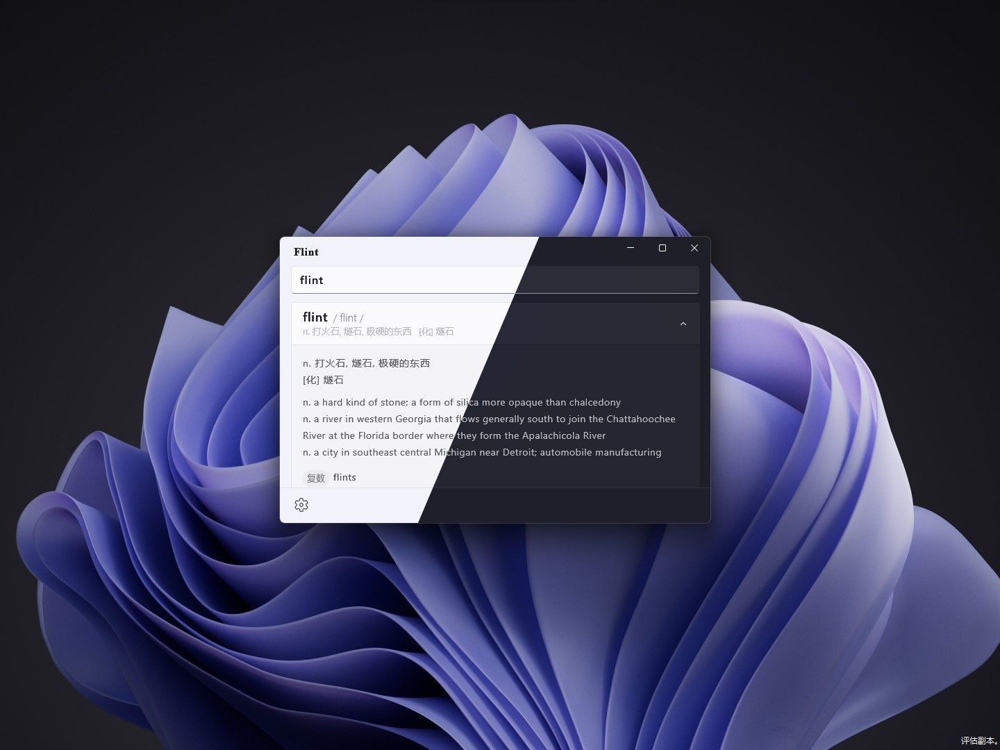

##  <b>燧石 —— 随时随地查单词</b>

经常在电脑上查阅英文内容的朋友，你是否和我有一样的困扰：每当遇到一个陌生的单词，就要打开浏览器 - 在搜索引擎中输入单词 - 然后跳转到结果页面 - 最后从众多结果中找到想要的答案。这繁琐的搜索过程让人身心俱疲，更别提这期间出现的转圈圈和大量广告了。现在，借助这款词典应用"燧石"，整个流程就简单了很多，你只需要打开"燧石"，然后输入单词，甚至都不需要再按回车键，答案就跃然屏幕之上。而且"燧石"使用的是源于[ECDICT](https://github.com/skywind3000/ECDICT)的离线词典数据库，因此也无需与网络打交道（虽然这让APP的存储占用大了不少）。
"燧石"随地查单词，任何问题或者功能需求都请联系我😀

---
## To Do
- 添加一个始终置顶的按钮
- 设置页面 Logo 位置加个 Bonfire Lit 的彩蛋
- 迁移到 WinUI 3，添加系统托盘图标，全局快捷键唤起输入框而非窗口

© 2023 sh0ckj0ckey.
