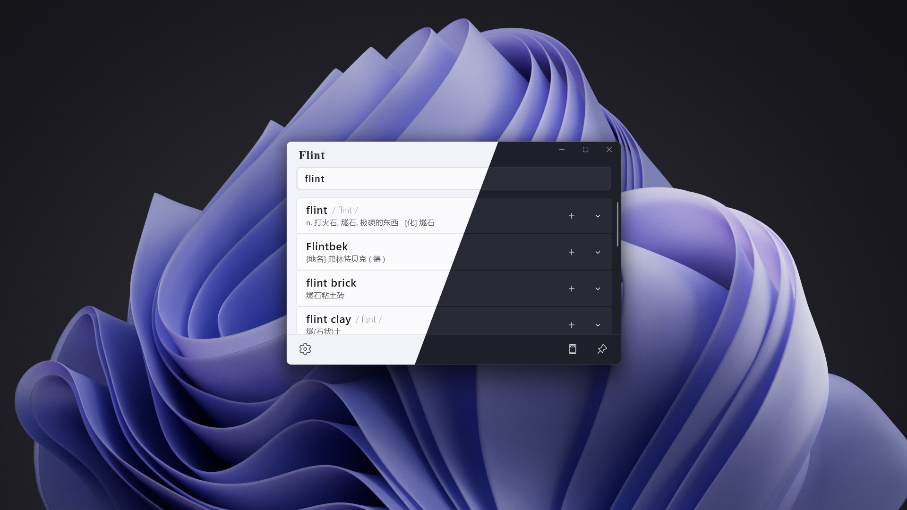

<p align="center">
    
</p>

<h3 align="center">燧石，随地查单词</h3>

经常在电脑上查阅英文内容的朋友，你是否和我有一样的困扰：
每当遇到一个陌生的单词，就要打开浏览器 - 在搜索引擎中输入单词 - 然后跳转到结果页面 - 最后从众多结果中找到想要的答案。这繁琐的搜索过程让人身心俱疲，更别提这期间出现的转圈圈和大量广告了。

现在，借助这款词典应用"燧石"，整个流程就简单了很多，你只需要打开"燧石"，然后输入单词，甚至都不需要再按回车键，答案就跃然屏幕之上。而且"燧石"使用的是源于 [ECDICT](https://github.com/skywind3000/ECDICT) 的离线词典数据库，因此也无需与网络打交道（虽然这让 APP 的存储占用大了不少，但这一切都是值得的）。

#### 点击下方按钮即可下载

<a href="https://apps.microsoft.com/detail/9p8735fcs5s9?mode=full">
	
</a>

#### TODO

- 修复首次唤起简洁搜索框时焦点并不在搜索框中，并且有概率显示出空白结果的区域；
- 添加生词本 Popup 中默认选中上一个或第一个生词本；
- 生词本各个页面底部栏增加主页按钮，点击后逐页向上返回至搜词主页；
- 增加联网搜词的功能，藉此中英互搜就能够得到支持；

#### 一睹芳容


---

#### 关于 WinUI 3 打包
WinUI 3 目前不像 UWP 支持直接打出 appxbundle、msixbundle 这种类型的包，需要自己手动打出 x64 和 ARM64 的 msix 包，然后这样操作：
将这两个 msix 文件放到例如 C 盘根目录的 Source 文件夹内(不能有其他文件)，然后管理员运行终端如下命令：

```
 "C:\Program Files (x86)\Windows Kits\10\bin\10.0.22621.0\x86\MakeAppx.exe" bundle /d "C:\Source" /p C:\out.msixbundle
```

这样就可以得到一个 msixbundle 包用来上传微软商店了

---

#### 自包含依赖项
在 `.csproj` 文件添加如下

```
<WindowsAppSDKSelfContained>true</WindowsAppSDKSelfContained>
<SelfContained>true</SelfContained>
```

这样打的包才会附带运行时，否则在一些电脑上运行时会弹出弹窗，称需要安装或更新 .Net 才可以运行此软件 (Microsoft.NETCore.App)

---

#### 数据库文件
GitHub 的 LFS 空间和带宽不够用，所以压缩成 7z 文件放在 Flint3/Data 中，解压后将文件属性设置为"内容"，这样就可以作为内置的文件来访问了

---

© 2024 sh0ckj0ckey.
